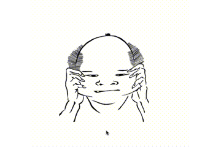

Hokusai Manga on the web
====

Hokusai Manga (北斎漫画) with HTML5 and JavaScript.

## Description
This is a reproduction of a part of Hokusai Manga (北斎漫画) which is one of collection of sketches by the Japanese ukiyo-e painter, Katsushika Hokusai (葛飾北斎) on the web using canvas element of HTML5 & JavaScript, and no any image files.
Additionally, it can be distorted by dragging with mouse or finger. 

## Demo
Demo page is [here](http://onumber9mt.github.io/hokusaimanga/).

## Usage
Just browse index.html and drug the paint.

